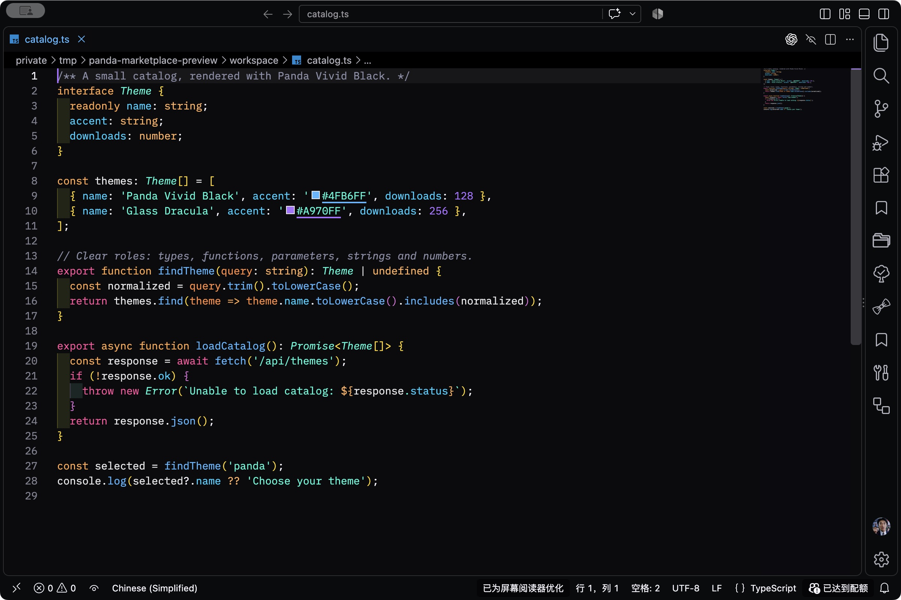
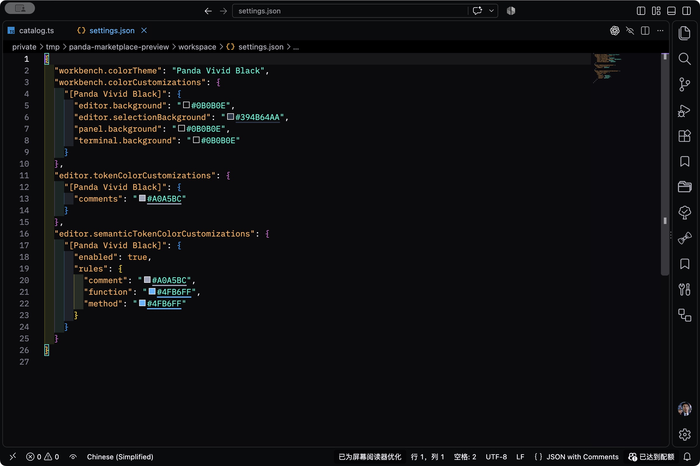

<p align="center">
  
</p>

# Panda Vivid Black

**A quiet dark workspace. Vivid, readable code.**

Panda Vivid Black pairs a near-black editor with bright blue functions, teal strings and types, magenta keywords, and soft gray comments. Built by **BennyWu**, it brings Panda-inspired syntax colors to a carefully tuned dark interface.

Designed around everyday **Flutter / Dart, Go, and Vue / JavaScript / TypeScript** development, with TextMate syntax colors and semantic token styling for language extensions that support it.

[中文介绍](#中文介绍) · [Source code](https://github.com/BugsBunny-7/Panda-Vivid-Black-vscode) · [Report an issue](https://github.com/BugsBunny-7/Panda-Vivid-Black-vscode/issues)

## Panda Modern Dark / 新增主题

**Panda Modern Dark** starts from a complete, frozen copy of VS Code's **2026 Dark** theme, including its inherited Dark Modern, Dark+, and Visual Studio Dark rules. The original **Panda Vivid Black** remains available with its existing colors.

Panda Modern Dark 以「2026 深色」完整副本为基础，按参考图调整为近黑背景、橙色关键字、浅蓝类型名、紫色函数名、灰白正文和中灰注释。参考图未出现的颜色，也根据对应色之间的差值一起调整，保留原有透明度。灰阶与彩色分别计算，避免把彩色语法提浅发白；字符串使用「2026 深色」JSON 键名的绿色 `#7EE787`，括号采用参考图中的灰白色。Dart 基础高亮与常用语义标记对齐参考图中的角色颜色。

| Role / 用途 | Color / 颜色 |
| --- | --- |
| Editor background / 编辑器背景 | `#0C0C0C` |
| Header / 标题背景 | `#0F0F0F` |
| Border / 边框 | `#272727` |
| Keywords and operators / 关键字、运算符 | `#FF804F` |
| Types / 类型 | `#79B8FF` |
| Functions / 函数 | `#B084FF` |
| Strings / 字符串 | `#7EE787` · 2026 Dark JSON key green |
| Text / 正文 | `#E8E8E8` |
| CodeLens / Run、Debug、Profile | `#E8E8E8` |
| Dart annotations / Dart 注解 | `#FFA618` |
| Comments / 注释 | `#888888` |
| Inactive line numbers / 非当前行行号 | `#3D3D3D` |

These are representative colors sampled from a JPEG reference, not the unknown original theme's exact source values. The complete baseline, palette-difference method, and source provenance are documented in [Panda Modern Dark palette notes](docs/panda-modern-dark.md). In a build containing this variant, select **Panda Modern Dark** from **Preferences: Color Theme**.

## In the editor / 实际运行截图

Captured in VS Code on macOS with Panda Vivid Black installed. These are real editor captures of sample code, not generated mockups. Fonts, icons, layout, and extra extension decorations shown are personal editor settings and are not bundled with the theme.

### TypeScript



### JSON settings



以上为主题实际运行截图；字体、图标、布局与额外扩展装饰不属于主题。第二张展示配置文件的语法配色，不是应用自定义颜色后的对比图。

## What you get

- **Near-black surfaces.** The editor, gutter, minimap, terminal, and bottom panel share `#0B0B0E`.
- **Distinct syntax colors.** Blue functions, teal types and strings, magenta keywords, orange parameters, and purple numbers help separate code roles.
- **Readable comments and selections.** Soft gray comments and subdued selection backgrounds keep text visible.
- **Calm completion and diff views.** Dark completion selections, subtle olive additions, and dark rose deletions avoid large bright fills behind code.
- **A consistent interface.** Blue active accents and dark status bars across normal, empty, and debugging windows.
- **A theme-only extension.** No runtime code, telemetry, AI features, or bundled language tools.

## Install and activate

1. Open **Extensions** in VS Code and search for **Panda Vivid Black** by **BennyWu**.
2. Install the extension.
3. Open the Command Palette, run **Preferences: Color Theme**, and select **Panda Vivid Black**.

The extension changes colors only. Keep your preferred fonts, formatters, language extensions, and editor layout.

## Palette

| Role | Color |
| --- | --- |
| Editor / terminal background | `#0B0B0E` |
| Keywords | `#FF2D8D` |
| Functions / methods | `#4FB6FF` |
| Types / classes | `#19F9D8` · italic |
| Strings | `#19F9D8` |
| Parameters | `#FF8A3D` |
| Properties | `#00CFFF` |
| Numbers | `#A970FF` |
| Comments | `#898DA5` · italic |

Exact token roles depend on the language grammar and its semantic highlighting provider.

## Customize colors / 自定义主题颜色

Open **Preferences: Open User Settings (JSON)** from the Command Palette. Merge the keys you need into your existing `settings.json`; do not replace the whole file or create duplicate top-level keys. Use `.vscode/settings.json` instead if the overrides should apply only to one project.

在命令面板执行“首选项：打开用户设置 (JSON)”，把需要的设置合并到已有配置。下面的 `[Panda Vivid Black]` 将覆盖范围限定为本主题，不影响 Glass Dracula 等其他主题。不要直接修改扩展目录里的主题文件，更新扩展会覆盖那些修改。

### 1. Backgrounds and selections / 背景与选区

This example uses a slightly lighter dark background and a more visible blue selection. These are optional overrides, not the theme defaults.

```json
{
  "workbench.colorCustomizations": {
    "[Panda Vivid Black]": {
      "editor.background": "#141418",
      "editorGutter.background": "#141418",
      "minimap.background": "#141418",
      "panel.background": "#141418",
      "terminal.background": "#141418",
      "editor.selectionBackground": "#394B64AA",
      "editor.inactiveSelectionBackground": "#394B6466",
      "editorSuggestWidget.selectedBackground": "#273246",
      "editorSuggestWidget.selectedForeground": "#F0F0F0"
    }
  }
}
```

`#RRGGBBAA` includes opacity: the last two digits range from `00` (transparent) to `FF` (opaque). 选区和差异背景建议保留透明度，避免遮住其他标记。

### 2. Brighter comments, softer functions / 提亮注释、调整函数色

Set both syntax and semantic rules so a language server does not replace your chosen colors after analysis. Here comments become lighter and functions use a softer blue.

```json
{
  "editor.tokenColorCustomizations": {
    "[Panda Vivid Black]": {
      "comments": "#A0A5BC",
      "functions": "#82C5FF"
    }
  },
  "editor.semanticTokenColorCustomizations": {
    "[Panda Vivid Black]": {
      "enabled": true,
      "rules": {
        "comment": "#A0A5BC",
        "function": "#82C5FF",
        "method": "#82C5FF"
      }
    }
  }
}
```

基础高亮使用 `editor.tokenColorCustomizations`；语言服务提供的语义高亮使用 `editor.semanticTokenColorCustomizations`。这里只改注释和函数，不会重设字符串、关键字等其他语法色。具体符号的类别仍由语言扩展决定。

### 3. Upright comments / 取消注释斜体

Merge `textMateRules` into the same theme block above, and merge the semantic `comment` rule into its existing `rules` object:

```json
{
  "editor.tokenColorCustomizations": {
    "[Panda Vivid Black]": {
      "textMateRules": [
        {
          "scope": ["comment", "comment.block.documentation"],
          "settings": { "foreground": "#A0A5BC", "fontStyle": "" }
        }
      ]
    }
  },
  "editor.semanticTokenColorCustomizations": {
    "[Panda Vivid Black]": {
      "rules": {
        "comment": { "foreground": "#A0A5BC", "italic": false }
      }
    }
  }
}
```

To restore the theme defaults, remove the individual overrides you added. If a token still has an unexpected color, run **Developer: Inspect Editor Tokens and Scopes** with the caret on it to identify its TextMate scope and semantic type.

恢复默认颜色：删除自己添加的对应覆盖项即可。如果个别词仍未变色，在该词上执行“开发人员：检查编辑器标记和作用域”，根据实际作用域或语义类别定位规则。

More options: [VS Code theme customization](https://code.visualstudio.com/docs/configure/themes#_customize-a-color-theme) · [Theme color reference](https://code.visualstudio.com/api/references/theme-color) · [Semantic highlighting guide](https://code.visualstudio.com/api/language-extensions/semantic-highlight-guide).

## Fonts and semantic highlighting

No special font is required. Use any coding font you like; a font with a true italic face will show the theme's italic type and comment styling more clearly.

Semantic highlighting is enabled by the theme. Install the official language tooling for your workflow, such as Dart / Flutter, Go, or Vue - Official, to provide language-aware highlighting. These extensions are not installed automatically.

Basic syntax highlighting appears first. Semantic colors can refine identifiers when the language server finishes analyzing the project. The theme aligns common syntax and semantic colors where possible, but it cannot control language-server startup time.

## 中文介绍

**深色界面，鲜明代码。**

Panda Vivid Black 是由 **BennyWu** 制作的近黑色 VS Code 主题，面向日常 Flutter / Dart、Go、Vue / JavaScript / TypeScript 开发。

- 编辑器、终端和底部面板采用统一的近黑背景。
- 蓝色函数、青绿色类型与字符串、洋红色关键字，让不同代码角色更容易辨认。
- 提亮偏暗注释，使用克制的选区、补全和 Git 差异背景，兼顾层次与可读性。
- 普通窗口、空窗口及调试状态保持深色状态栏。
- 支持语义高亮；仅提供主题，不包含运行代码、遥测、AI 功能或语言服务。

**使用方法：** 在扩展市场搜索 **Panda Vivid Black**，安装后执行“首选项：颜色主题”，选择同名主题即可。不要求更换字体，也不会修改你的格式化与编辑习惯。

语义颜色取决于语言扩展的分析结果。主题会尽量统一基础高亮与语义高亮的配色，但不承诺语言服务启动耗时。

Panda Vivid Black 与同作者的 **Glass Dracula** 是独立扩展，可以同时安装并随时切换。

## Credits and license

- Syntax foundation and color inspiration: [Panda Syntax](https://github.com/siamak/panda-syntax-vscode) by Siamak Mokhtari and contributors.
- Dark interface foundation: **Dracula Dark Vivid Black / Glass Dracula** by BennyWu.
- Panda Vivid Black is an independently maintained adaptation, not an official release of Panda Syntax or Dracula.

See [LICENSE](LICENSE) for this project's license.
